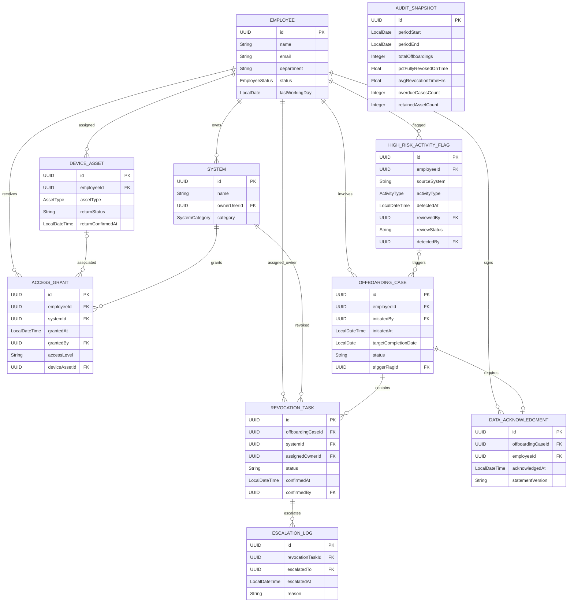

# AccessGuard ER diagram

All actor UUIDs reference Employee. The employee/system many-to-many relationship is stored through AccessGrant, which owns grant metadata. The JPA many-to-many collections are immutable read-only projections. Optional deviceAssetId and triggerFlagId implement the two relationships missing foreign keys in the supplied attributes.
